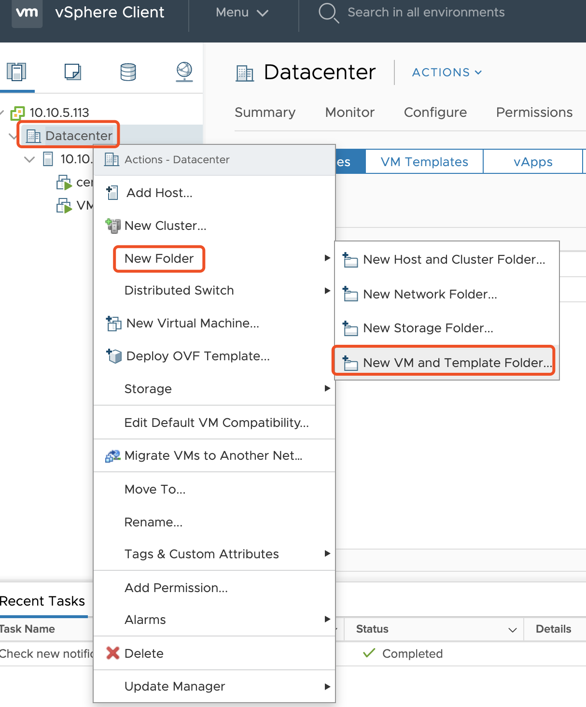
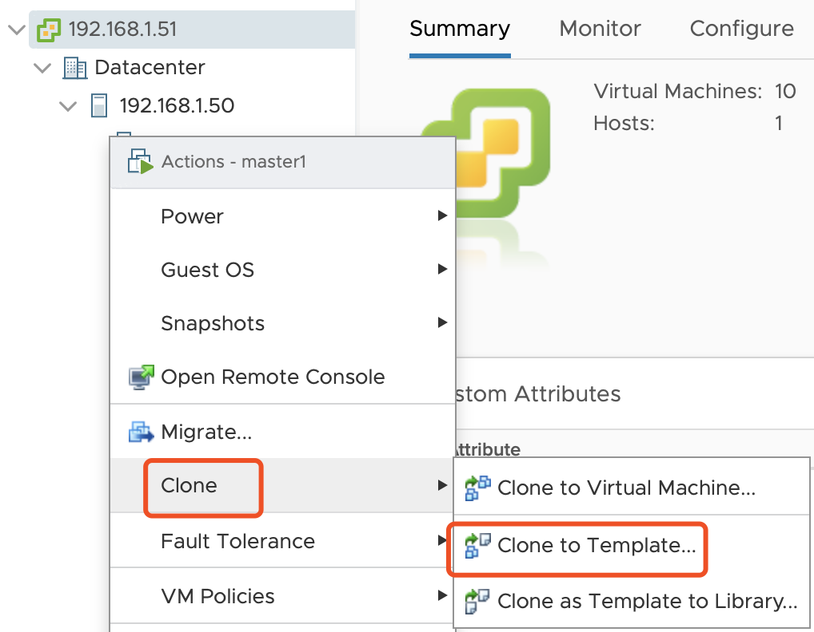
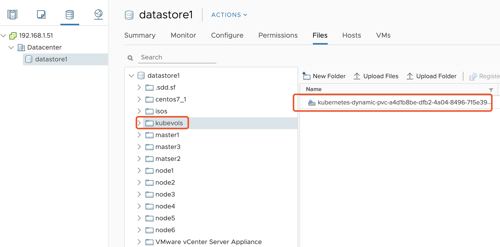

# 基于Kubespray的生产级Kubernetes部署

## 1. 前置条件

​	安装EXSI（VMware vSphere Hypervisor，本例地址为:192.168.1.50）：http://dl1.technet24.ir/Downlads/Software/VMware/vCenter/67u3/VMware-VMvisor-Installer-6.7.0.update03-14320388.x86_64.iso

​	安装VCenter（VMware vCenter Server Appliance,本例地址为:192.168.1.51）：http://dl1.technet24.ir/Downloads/Software/VMware/vCenter/67u3/VMware-VCSA-all-6.7.0-14367737.iso

使用U盘将VMware-VMvisor-Installer-6.7.0.update03-14320388.x86_64.iso刻盘安装EXSI系统到一台物理机，然后打开VMware-VCSA-all-6.7.0-14367737.iso。在vcsa-ui-installer目录下按照不同的系统使用对应的界面安装VCenter。

当然如果你有直接的机器或者虚拟机也是可以的，我们只需要忽略和VMware相关的步骤即可，这次规划9台虚拟机（物理机），

## 2. 准备CentOS系统模板

- Vsphere client下创建虚拟机目录，名称为`k8s`

  

  

- VCenter下创建CentOS虚拟机：虚拟机名称为`centos7`

- 安装CentOS 7.6虚拟机

- 安装VMware Tools

  ```shell
  yum install -y open-vm-tools
  ```

- 安装govc：https://github.com/vmware/govmomi/releases

  ```shell
  yum install wget
  wget https://github.com/vmware/govmomi/releases/download/prerelease-v0.21.0-58-g8d28646/govc_linux_amd64.gz
  gzip -d govc_linux_amd64.gz
  chmod +x govc_linux_amd64
  mv govc_linux_amd64 /usr/local/bin/govc
  ```

- 配置govc

  ```shell
  vi .bash_profile 
  
  export GOVC_URL='192.168.1.51'
  export GOVC_USERNAME='administrator@vsphere.local'
  export GOVC_PASSWORD='Wyf.38476'
  export GOVC_INSECURE=1
  
  source .bash_profile 
  ```

- 激活虚拟机UUID，后面为虚拟机名称

  ```shell
  govc vm.change -e="disk.enableUUID=1" -vm='centos7'
  ```

- 安装perl和nettools，ansible定制虚拟机ip需使用

  ```shell
  yum install perl net-tools
  ```
  
- 关闭防火墙

  ```
   systemctl stop firewalld && systemctl disable firewalld
  ```

- 时间同步

  ```
  yum -y install ntp  && ntpdate ntp1.aliyun.com && systemctl start ntpd && systemctl enable ntpd
  ```

- 操作机免密登陆虚拟机

  产生公钥与私钥对：
  
  ```
  ssh-keygen
  ```
  
  将本机的公钥复制到远程机器的authorized_keys文件中：
  
  ```shell
  ssh-copy-id root@192.168.1.5*
  ```
  
- 将虚拟机制成模板

  


## 3. 准备虚拟机

- 安装ansible

  ```shell
  pip3 install PyVmomi
  pip3 install ansible
  ```

- 编写ansible playbook：`vm.yml`

  ```yaml
  - hosts: 127.0.0.1
    connection: local
    become: root
    gather_facts: false
    serial: 1
    tasks:
      - name:  Create Master Nodes
        vmware_guest:
          hostname: "{{ vcenter_hostname }}"
          username: "{{ vcenter_username }}"
          password: "{{ vcenter_password }}"
          validate_certs: no
          datacenter: "{{ datacenter }}"
          state: present
          folder: "{{ folder }}"
          template: "{{ template }}"
          name: "{{ item.key }}"
          cluster: "{{ cluster }}"
          disk:
            - size_gb: 30
              type: thin
              datastore: datastore1
          hardware:
            memory_mb: 2048
            num_cpus: 2
            scsi: paravirtual
          networks:
            - name: VM Network
              ip: "{{ item.value }}"
              netmask: 255.255.255.0
              gateway: 192.168.1.1
          wait_for_ip_address: True
          customization:
            dns_servers:
              - 202.102.192.68
              - 114.114.114.114
        with_dict: "{{ masters }}"
        delegate_to: localhost
  
  
      - name:  Create Workder Nodes
        vmware_guest:
          hostname: "{{ vcenter_hostname }}"
          username: "{{ vcenter_username }}"
          password: "{{ vcenter_password }}"
          validate_certs: no
          datacenter: "{{ datacenter }}"
          state: present
          folder: "{{ folder }}"
          template: "{{ template }}"
          name: "{{ item.key }}"
          cluster: "{{ cluster }}"
          disk:
            - size_gb: 50
              type: thin
              datastore: datastore1
          hardware:
            memory_mb: 8192
            num_cpus: 4
            scsi: paravirtual
          networks:
            - name: VM Network
              ip: "{{ item.value }}"
              netmask: 255.255.255.0
              gateway: 192.168.1.1
          wait_for_ip_address: True
          customization:
            dns_servers:
              - 202.102.192.68
              - 114.114.114.114
        with_dict: "{{ workers }}"
        delegate_to: localhost
  
  ```
  
  变量信息：`group_vars/all.yml`：

  ```yaml
    vcenter_hostname: 192.168.1.51
    vcenter_username: administrator@vsphere.local
    vcenter_password: Wyf.38476
    datacenter: Datacenter
    folder: /k8s
    template: centos7
    vm_name: master1
    cluster:
    masters: {"master1":"192.168.1.54", "matser2":"192.168.1.55","master3":"192.168.1.56"}
    workers: {"node1":"192.168.1.57","node2":"192.168.1.58","node3":"192.168.1.59","node4":"192.168.1.60","node5":"192.168.1.61","node6":"192.168.1.62"}
  ```

创建虚拟机：
  ```shell
 ansible-playbook vm.yml    
  ```


## 4. 使用kubespray安装

- 下载kubespray最新发布版：https://github.com/kubernetes-sigs/kubespray/releases，当前最新版为[v2.11.0](https://github.com/kubernetes-sigs/kubespray/releases/tag/v2.11.0)

- 安装ansible依赖

  ```shell
  sudo pip3 install -r requirements.txt
  ```

- 复制inventory

  ```shell
  cp -rfp inventory/sample inventory/mycluster
  ```

- 使用inventory builder更新inventory文件

  ```shell
  declare -a IPS=(192.168.1.54 192.168.1.55 1192.168.1.56 192.168.1.57 192.168.1.58 192.168.1.59 192.168.1.60 192.168.1.61 192.168.1.62)
  
  CONFIG_FILE=inventory/mycluster/hosts.yml python3 contrib/inventory_builder/inventory.py ${IPS[@]}
  ```

  对生成`inventory/mycluster/hosts.yml`进行修改，主要调整每个虚拟机在集群中承担的角色，修改后的内容如下：

  ```yaml
  all:
    hosts:
      master1:
        ansible_host: 192.168.1.54
        ip: 192.168.1.54
        access_ip: 192.168.1.54
        ansible_user: root
      master2:
        ansible_host: 192.168.1.55
        ip: 192.168.1.55
        access_ip: 192.168.1.55
        ansible_user: root
      master3:
        ansible_host: 192.168.1.56
        ip: 192.168.1.56
        access_ip: 192.168.1.56
        ansible_user: root
      node1:
        ansible_host: 192.168.1.57
        ip: 192.168.1.57
        access_ip: 192.168.1.57
        ansible_user: root
      node2:
        ansible_host: 192.168.1.58
        ip: 192.168.1.58
        access_ip: 192.168.1.58
        ansible_user: root
      node3:
        ansible_host: 192.168.1.59
        ip: 192.168.1.59
        access_ip: 192.168.1.59
        ansible_user: root
      node4:
        ansible_host: 192.168.1.60
        ip: 192.168.1.60
        access_ip: 192.168.1.60
        ansible_user: root
      node5:
        ansible_host: 192.168.1.61
        ip: 192.168.1.61
        access_ip: 192.168.1.61
        ansible_user: root
      node6:
        ansible_host: 192.168.1.62
        ip: 192.168.1.62
        access_ip: 192.168.1.62
        ansible_user: root
    children:
      kube-master:
        hosts:
          master1:
          master2:
          master3:
      kube-node:
        hosts:
          node1:
          node2:
          node3:
          node4:
          node5:
          node6:
      etcd:
        hosts:
          master1:
          master2:
          master3:
      k8s-cluster:
        children:
          kube-master:
          kube-node:
      calico-rr:
        hosts: {}
  
  ```
  
- 设置vsphere做为cloud provider，修改`inventory/mycluster/group_vars/all/all.yml`,添加下面内容：

  ```yaml
  cloud_provider: vsphere
  vsphere_vcenter_ip: "192.168.1.51"
  vsphere_vcenter_port: 443
  vsphere_insecure: 1
  vsphere_user: "administrator@vsphere.local"
  vsphere_password: "Wyf.38476"
  vsphere_datacenter: "Datacenter"
  vsphere_datastore: "datastore1"
  vsphere_working_dir: "k8s"
  vsphere_scsi_controller_type: "pvscsi"
  ```

- 切换下载地址，加速安装

  `inventory/mycluster/group_vars/k8s-cluster/k8s-cluster.yml`：

  ```yaml
  # kubernetes image repo define
  kube_image_repo: "gcr.azk8s.cn/google-containers"
  ```

  `roles/download/defaults/main.yml`：

  ```yaml
  # gcr and kubernetes image repo define
  gcr_image_repo: "gcr.azk8s.cn/google-containers"
  ```

  `roles/download/defaults/main.yml`：按照如下替换

  ```yaml
  docker.io -> dockerhub.azk8s.cn （其中官方镜像需要加library/）
  quay.io ->  quay.azk8s.cn
  gcr.io -> gcr.azk8s.cn
  k8s.gcr.io -> gcr.azk8s.cn/google-containers
  
  # Download URLs
  kubeadm_download_url: "https://storage.googleapis.com/kubernetes-release/release/{{ kubeadm_version }}/bin/linux/{{ image_arch }}/kubeadm"
  hyperkube_download_url: "https://storage.googleapis.com/kubernetes-release/release/{{ kube_version }}/bin/linux/{{ image_arch }}/hyperkube"
  etcd_download_url: "https://github.com/coreos/etcd/releases/download/{{ etcd_version }}/etcd-{{ etcd_version }}-linux-{{ image_arch }}.tar.gz"
  cni_download_url: "https://github.com/containernetworking/plugins/releases/download/{{ cni_version }}/cni-plugins-linux-{{ image_arch }}-{{ cni_version }}.tgz"
  calicoctl_download_url: "https://github.com/projectcalico/calicoctl/releases/download/{{ calico_ctl_version }}/calicoctl-linux-{{ image_arch }}"
  crictl_download_url: "https://github.com/kubernetes-sigs/cri-tools/releases/download/{{ crictl_version }}/crictl-{{ crictl_version }}-{{ ansible_system | lower }}-{{ image_arch }}.tar.gz"
  ```

  `roles/container-engine/docker/defaults/main.yml`：

  ```yaml
  # CentOS/RedHat docker-ce repo
  docker_rh_repo_base_url: 'https://mirrors.aliyun.com/docker-ce/linux/centos/7/$basearch/stable'
  docker_rh_repo_gpgkey: 'https://mirrors.aliyun.com/docker-ce/linux/centos/gpg'
  
  # CentOS/RedHat Extras repo
  extras_rh_repo_base_url: "https://mirrors.aliyun.com/centos/$releasever/extras/$basearch/"
  extras_rh_repo_gpgkey: "https://mirrors.aliyun.com/centos/RPM-GPG-KEY-CentOS-7"
  ```

- 安装helm服务端tiller

  `roles/kubernetes-apps/helm/defaults/main.yml`
  
  ```yaml
  helm_enabled: true
  ```
  
- 安装Kubernetes集群

  ```shell
  ansible-playbook -i inventory/mycluster/hosts.yml --become --become-user=root cluster.yml
  ```

## 5. 连接K8s集群

- 安装kubectl

  macOS的安装方式：
  
  ```shell
  brew install kubernetes-cli 
  ```
  
  Windows安装：https://kubernetes.io/docs/tasks/tools/install-kubectl/#install-kubectl-on-windows
  
- 配置环境

  ssh登录到192.168.1.54 master节点复制`~/.kube/config`到本地；

- dashboard访问登录地址

  https://192.168.1.54:6443/[api/v1/namespaces/kube-system/services/https:kubernetes-dashboard:/proxy/#!/login](https://192.168.1.54:6443/api/v1/namespaces/kube-system/services/https:kubernetes-dashboard:/proxy/#!/login)

- 通过代理访问dashboard地址

  ```
  kubectl proxy
  ```

  http://localhost:8001/api/v1/namespaces/kube-system/services/https:kubernetes-dashboard:/proxy/#!/login](http://localhost:8001/api/v1/namespaces/kube-system/services/https:kubernetes-dashboard:/proxy/#!/login)

- 生成kubeconfig

  1. 新建`admin-role.yml`

     ```yaml
     kind: ClusterRoleBinding
     apiVersion: rbac.authorization.k8s.io/v1beta1
     metadata:
       name: admin
       annotations:
         rbac.authorization.kubernetes.io/autoupdate: "true"
     roleRef:
       kind: ClusterRole
       name: cluster-admin
       apiGroup: rbac.authorization.k8s.io
     subjects:
       - kind: ServiceAccount
         name: admin
         namespace: kube-system
     ---
     apiVersion: v1
     kind: ServiceAccount
     metadata:
       name: admin
       namespace: kube-system
       labels:
         kubernetes.io/cluster-service: "true"
         addonmanager.kubernetes.io/mode: Reconcile
     ```

  2. 获得token

     ```shell
     kubectl create -f admin-role.yaml
     kubectl -n kube-system get secret|grep admin-token
     kubectl -n kube-system describe secret/admin-token-2qphr
     ```

  3. 将获得的token附加到config文件

     ```yaml
     token: ....
     ```

  4. 在登录页面的“Kubeconfig”选择config文件进行登录
  
  5. 在登录页面的“令牌”，直接粘贴token进行登录

## 6 存储类配置

基于vsphere的k8s存储，新建`storage/vsphere-storage.yml`：

```yaml
kind: StorageClass
apiVersion: storage.k8s.io/v1
metadata:
  name: standard
  annotations:
    storageclass.kubernetes.io/is-default-class: "true"
provisioner: kubernetes.io/vsphere-volume
parameters:
  diskformat: zeroedthick
  datastore: datastore1
```

````shell
kubectl create -f vsphere-storage.yml
````

测试是否成功，新建`storage/test-pvc.yml`

```yaml
 kind: PersistentVolumeClaim
apiVersion: v1
metadata:
  name: pvcsc-vsan
  annotations:
    volume.beta.kubernetes.io/storage-class: standard
spec:
  accessModes:
    - ReadWriteOnce
  resources:
    requests:
      storage: 2Gi
```

```shell
kubectl create -f test-pvc.yml
kubectl describe pvc pvcsc-vsan
```

此时我们在vsphere client上查看：



## 7 安装配置Helm

- 安装helm

  macOS的安装方式：

```shell
brew install kubernetes-helm
```

​	Windows：使用Chocolatey（安装参考：https://chocolatey.org/install）

```shell
choco install kubernetes-helm
```

- 初始化helm

```shell
helm init --upgrade -i gcr.azk8s.cn/kubernetes-helm/tiller:v2.14.3 --stable-repo-url  https://kubernetes.oss-cn-hangzhou.aliyuncs.com/charts/

helm repo update
```

- 创建用户tiller用户

```shell
kubectl create serviceaccount --namespace kube-system tiller
kubectl create clusterrolebinding tiller-cluster-rule --clusterrole=cluster-admin --serviceaccount=kube-system:tiller
kubectl patch deploy --namespace kube-system tiller-deploy -p '{"spec":{"template":{"spec":{"serviceAccount":"tiller"}}}}'
```

